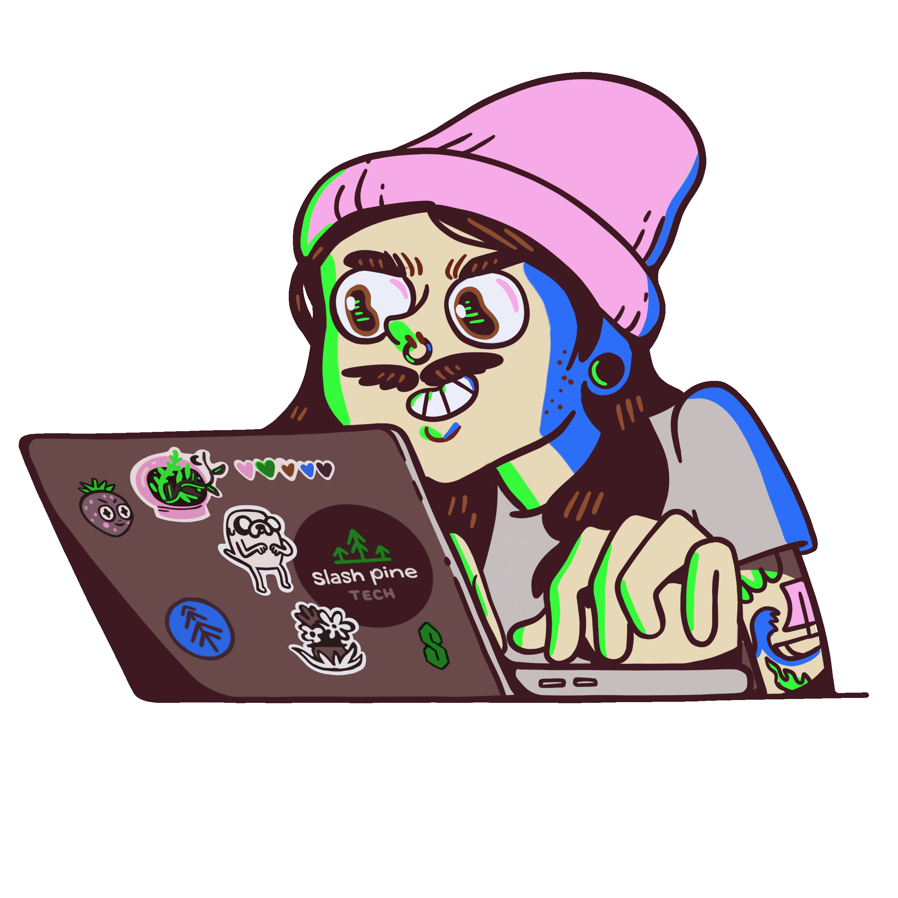

# ⚡ Building Intelligent AI Applications with Modern Technologies

<table>
<tr>

<td width="60%">

### 👋 About Me

I'm **Yatendra Gupta**, a B.Tech Computer Science (AI & ML) student passionate about building intelligent software powered by Artificial Intelligence and Generative AI.

I enjoy combining:

- 🤖 Generative AI & Large Language Models
- 📚 Retrieval-Augmented Generation (RAG)
- 💻 Full Stack Development
- 🧠 Machine Learning & Intelligent Systems
- 📄 Resume: **[View My Resume](https://drive.google.com/file/d/11VbZrU7qUb91smn5OPJrXhCPnOrlvhD8/view)**

From developing **AI-powered RAG Document Assistants** to building **Content Localization Platforms** and **RAG Chatbots**, I enjoy solving real-world problems through practical AI applications.

Currently focused on strengthening my skills in **Software Development, Generative AI, Machine Learning, and Full Stack Development** while building production-ready projects.

</td>

<td width="40%" align="center" valign="middle">
    
</td>

</tr>
</table>

---

<h1 align="center">🧑‍🤝‍🧑 Connect with Me</h1>

<table align="center">
<tr>
<td align="center">

</td>

<td align="center">

</td>

<td align="center">

</td>

</tr>
</table>

---

<h1 align="center">🛠️ Tech Arsenal</h1>

### Languages

### Frontend

### Backend

### Tools

### Exploring Tools 

---

<h1 align="center">🔥 GitHub Stats</h1>

  

---

<h1 align="center">🚀 Featured Projects</h1>

<table>

<tr>

<td width="33%">

### 📚 RAGDoc Assistant

AI-powered document question answering system

✔ AI Document Q&A

✔ Gemini API Integration

✔ LangChain Pipeline

✔ Multi-format Documents

✔ Supabase Vector DB

**Python • Flask • Gemini • Supabase**

</td>

<td width="33%">

### 🌍 Automated Content Localization

AI-powered localization platform

✔ Text Localization

✔ Speech Recognition

✔ Voice Translation

✔ Multilingual Support

✔ OCR Integration

**Python • Flask • Gemini • Speech Recognition**

</td>

<td width="33%">

### 🤖 RAG Chatbot

AI-powered PDF Question Answering Chatbot

✔ PDF Question Answering

✔ LangChain Pipeline

✔ FAISS Vector Store

✔ Context-Aware Responses

✔ Fast Document Retrieval

**Streamlit • LangChain • FAISS • Gemini**

</td>

</tr>

</table>

---

<h1 align="center">✍️ Random Dev Quote</h1>

---

